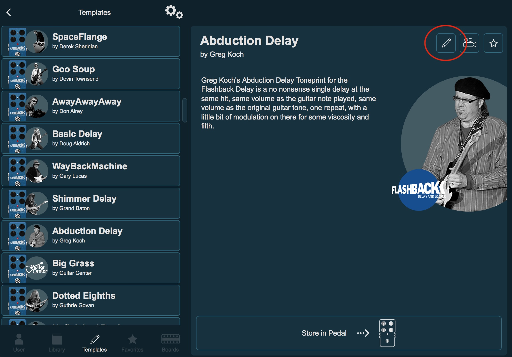

## Toneprint Server

If you are a user of the TC Electronic toneprint series of effects pedals you  know about how versatile they are.

And with the Toneprint editor they are even more, with this software you can edit a lot of hidden settings of the pedals.

There is only one limitation, you can only edit the template toneprints. And not the artists toneprints.

This will allow that.

### Why?

The toneprints data is stored in an encrypted sqlite (```~/Library/Application Support/TonePrint/databaseV1.sqlite3```)

That database is populated with the content of this 6 XML files located in ```~/Library/Application Support/TonePrint/XML```

- artists.xml
- effects.xml
- products.xml
- producttypes.xml
- selecttypes.xml
- toneprints.xml

In older versions of the software I believe you can just edit the xml and that lead to the modification of the databse.

But now it will download them from the cloud and only then it will update de database. So modify them has no effect.

So I came with this solution after tried to find how to decrypt the database with a debugger (I came very close, but I gave up).

Without direct access to the database our only possibility is to feed modified xmls to the app, so I have created a fake server.

### How it works?

This will create a fake server so the app thinks it is connected to the tcelectronic server and download the modified xmls.
With the modified files it will update the database.

The change is very simple, you just need to change the ```CanBeEdited``` value of the artist to ```True```

And you will be allowed to edit every toneprint.

### How to use it?

In order to this to work you will need to do 2 thins before

1. You will need to redirect the domain ```tp.tcelectronic.com``` to localhost in the ```/etc/hosts```
2. You will need to create a selfsigned certificate for that domain, put the files in the ```ssl``` folder and install the ```cert.pem``` (be sure to select to trust it). 
   
Example how to create it, just be sure to enter ```tp.tcelectronic.com```  as the common name.
```
openssl req -x509 -newkey rsa:4096 -nodes -out cert.pem -keyout key.pem -days 365
```

Now with the traffic redirected to localhost and the certificate installed you are ready to start the server.

***Because it needs to listen on the port 443 you will need to run it as root, or you can use nginx or some webserver but it's a lot of work just to do this.***

```
sudo ./app.py
```

If every thins is ok you will see this when the app connects and download the files

```
--------------------------------
Headers:  Host: tp.tcelectronic.com
Content-Type: text/xml; charset=utf-8
Connection: keep-alive
Soapaction: "http://tempuri.org/ITonePrintService/GetVersionsAndInfo"
Accept: */*
Accept-Language: es-xl
Content-Length: 176
Accept-Encoding: br, gzip, deflate
User-Agent: TonePrint/4.2.0 CFNetwork/902.6 Darwin/17.7.0 (x86_64)


Action: GetVersionsAndInfo
File: xml/GetVersionsAndInfoResponse.xml for action: GetVersionsAndInfo
127.0.0.1 - - [06/Jun/2021 12:24:33] "POST /TonePrintService.svc HTTP/1.1" 200 -
--------------------------------
Headers:  Host: tp.tcelectronic.com
Content-Type: text/xml; charset=utf-8
Connection: keep-alive
Soapaction: "http://tempuri.org/ITonePrintService/GetAllToneprintsFullBeta"
Accept: */*
Accept-Language: es-xl
Content-Length: 212
Accept-Encoding: br, gzip, deflate
User-Agent: TonePrint/4.2.0 CFNetwork/902.6 Darwin/17.7.0 (x86_64)


Action: GetAllToneprintsFullBeta
File: xml/toneprints.xml for action: GetAllToneprintsFullBeta
127.0.0.1 - - [06/Jun/2021 12:24:33] "POST /TonePrintService.svc HTTP/1.1" 200 -
--------------------------------
Headers:  Host: tp.tcelectronic.com
Content-Type: text/xml; charset=utf-8
Connection: keep-alive
Soapaction: "http://tempuri.org/ITonePrintService/GetAllArtistsFullBeta"
Accept: */*
Accept-Language: es-xl
Content-Length: 206
Accept-Encoding: br, gzip, deflate
User-Agent: TonePrint/4.2.0 CFNetwork/902.6 Darwin/17.7.0 (x86_64)


Action: GetAllArtistsFullBeta
File: xml/artists.xml for action: GetAllArtistsFullBeta
127.0.0.1 - - [06/Jun/2021 12:24:34] "POST /TonePrintService.svc HTTP/1.1" 200 -
--------------------------------
Headers:  Host: tp.tcelectronic.com
Content-Type: text/xml; charset=utf-8
Connection: keep-alive
Soapaction: "http://tempuri.org/ITonePrintService/GetAllProductsFullBeta"
Accept: */*
Accept-Language: es-xl
Content-Length: 208
Accept-Encoding: br, gzip, deflate
User-Agent: TonePrint/4.2.0 CFNetwork/902.6 Darwin/17.7.0 (x86_64)


Action: GetAllProductsFullBeta
File: xml/products.xml for action: GetAllProductsFullBeta
127.0.0.1 - - [06/Jun/2021 12:24:34] "POST /TonePrintService.svc HTTP/1.1" 200 -
--------------------------------
Headers:  Host: tp.tcelectronic.com
Content-Type: text/xml; charset=utf-8
Connection: keep-alive
Soapaction: "http://tempuri.org/ITonePrintService/GetAllEffectsFullBeta"
Accept: */*
Accept-Language: es-xl
Content-Length: 206
Accept-Encoding: br, gzip, deflate
User-Agent: TonePrint/4.2.0 CFNetwork/902.6 Darwin/17.7.0 (x86_64)


Action: GetAllEffectsFullBeta
File: xml/effects.xml for action: GetAllEffectsFullBeta
127.0.0.1 - - [06/Jun/2021 12:24:34] "POST /TonePrintService.svc HTTP/1.1" 200 -
--------------------------------
Headers:  Host: tp.tcelectronic.com
Content-Type: text/xml; charset=utf-8
Connection: keep-alive
Soapaction: "http://tempuri.org/ITonePrintService/GetAllProductTypesFull"
Accept: */*
Accept-Language: es-xl
Content-Length: 208
Accept-Encoding: br, gzip, deflate
User-Agent: TonePrint/4.2.0 CFNetwork/902.6 Darwin/17.7.0 (x86_64)


Action: GetAllProductTypesFull
File: xml/producttypes.xml for action: GetAllProductTypesFull
127.0.0.1 - - [06/Jun/2021 12:24:34] "POST /TonePrintService.svc HTTP/1.1" 200 -
--------------------------------
Headers:  Host: tp.tcelectronic.com
Content-Type: text/xml; charset=utf-8
Connection: keep-alive
Soapaction: "http://tempuri.org/ITonePrintService/GetAllSelectTypes"
Accept: */*
Accept-Language: es-xl
Content-Length: 198
Accept-Encoding: br, gzip, deflate
User-Agent: TonePrint/4.2.0 CFNetwork/902.6 Darwin/17.7.0 (x86_64)


Action: GetAllSelectTypes
File: xml/selecttypes.xml for action: GetAllSelectTypes
127.0.0.1 - - [06/Jun/2021 12:24:34] "POST /TonePrintService.svc HTTP/1.1" 200 -
```



The xml files in the xml folder already have the modification to enable artists toneprint edit

***In the original_xml folder you will have the unmodified xml files in case you brake something***


***This is made for Mac but it should work on Windows***
